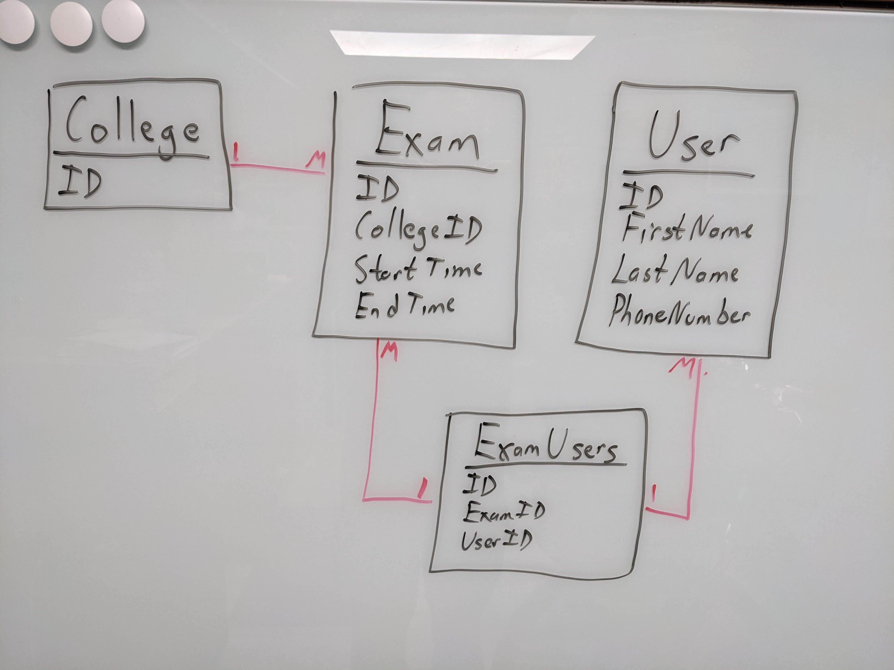

# Exams Exercise
This repo contains my implementation to the exams exercise. The exercise instructions are not included to preserve anonymity.

By day, I currently write C# with .NET Core. This was the first Ruby on Rails code I've written since 2018 and that was just a quick weekend foray. I have to go all the way back to 2015 for any other experience. I'll highlight here various thoughts from my implementation. In many cases, I went down rabbit holes just getting caught back up on current Rails best practices and conventions. A lot has changed since I've been heavily into it.

# Assumptions
I made several assumptions with the instructions. In reality, I would go back and forth with the team on requirements. In the interest of not getting bogged down in back and forth emails, I did not do that for this exercise. My assumptions include

* The 200 response has no body. In reality, I would use a 204 here, but the instructions said 200, so I left it as-is.
* The format of the error responses was undefined. I kept it very simple for this exercise.
* Users can be assigned to the same exam multiple times.
* No API tokens are required. The API is currently wide open. I assumed that is fine for the exercise.

# Data Model
I used the recommended models, except I did not break out `ExamWindow` into a separate model. I just included `start_time` and `end_time` directly on `Exam`. That is fine for the scope of this exercise, but I can see the need to break out `ExamWindow` as additional requirements come in.

I whiteboarded this diagram as I started. I later added the `ApiRequest` model, but did not update the diagram.


# Running
You can test the implementation by running

```
$ cd src
$ bin/rails db:setup
$ bin/rails server
```
The DB is seeded with some test data. You can hit the endpoint by sending a POST to `http://127.0.0.1:3000/assigned_exams` with the following body

```
{ 
  "first_name": "Devin",
  "last_name": "Townsend",
  "phone_number": "0293840239",
  "college_id": 1,
  "exam_id": 1,
  "start_time": "2021-06-07T08:00:00"
} 
```

If using VS Code, you can also load up the solution using remote containers. This container sets up Ruby 2.5.8, sqlite3, and Rails.

# Implementation

## Performance
All queries hit indexes. The only one I had to explicitly add was an index with a unique constraint on users across first_name, last_name, and phone_number. I assumed that the index should be unique.

## Exam Windows
As mentioned above, I did not break out `ExamWindow` into a separate model. The `Exam` model itself has a method to determine if a date is within the window.

## Security
I did not modify any of the default Rails security options. The API is not served via SSL.

The controller action itself uses methods that generate parameterized SQL to prevent SQL injection. Also, querying and inserting users uses strong parameters by using `permit`.

One thing I was not sure of from the instructions is what `valid and santized` means beyond what I implemented. I looked into using `require` on `params` as well to enforce the exact shape of the of the JSON body, but I did not implement it. This is something where I don't know the exact best practice in Rails, but could tell you exactly how to do it in ASP.NET Core.

## Tests
Unit tests are provided for some models and integration tests are provided for the controller. I used the default generator, so I'm using `Minitest::Unit`.

## User Creation
The requirements indicated to return a 400 if there is any issue finding, creating, or associating the user with the exam. I did not implement this part. This feels more like a 500 error if we have any issue with this. It's also very possible that I'm misreading some requirement around users though.